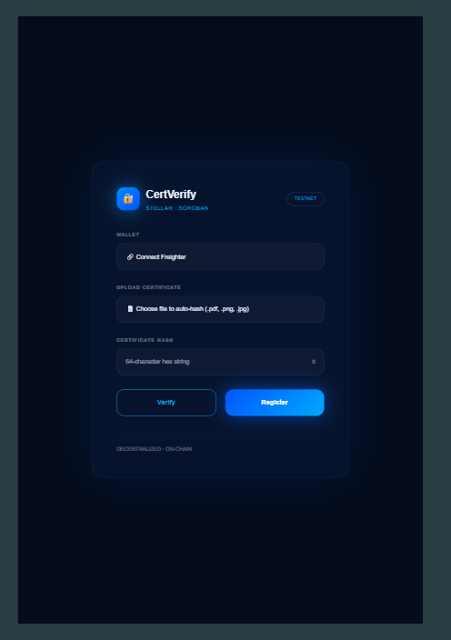
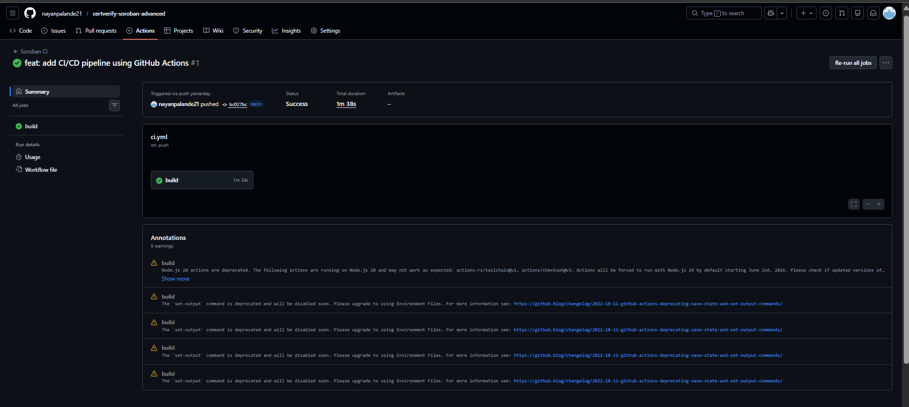
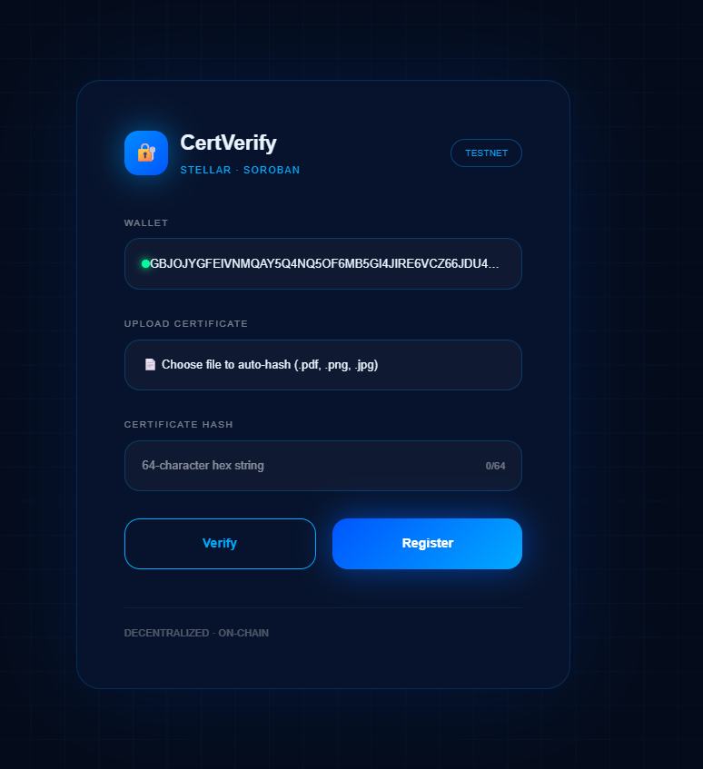
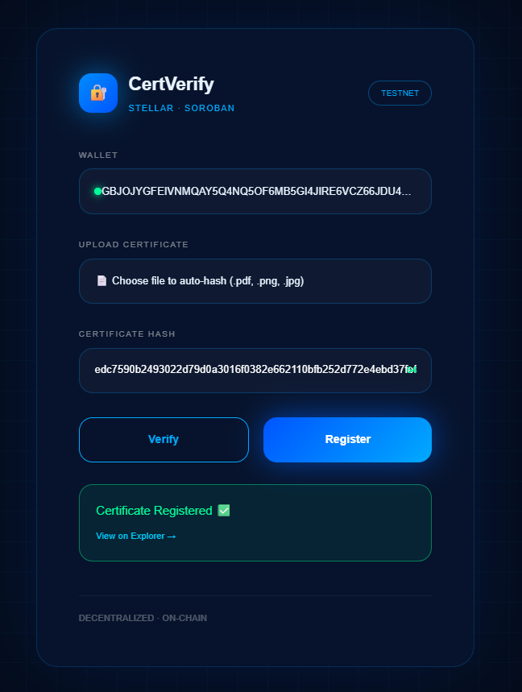
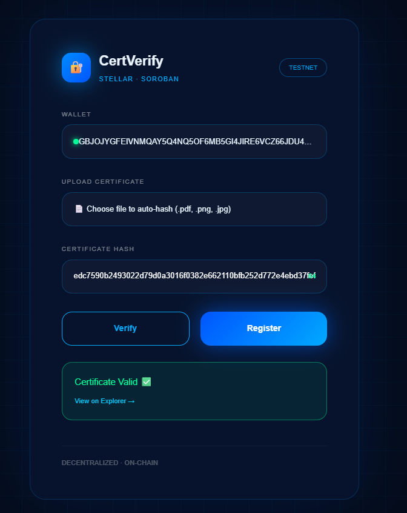
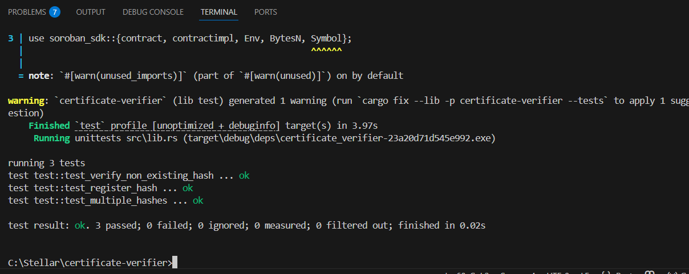

# CertVerify – Decentralized Certificate Verification dApp

CertVerify is a complete end-to-end decentralized application built using **Stellar Soroban smart contracts** and a **React + TypeScript frontend** to register and verify certificate hashes on-chain.

The application ensures certificate authenticity by storing cryptographic hashes of certificates on the **Stellar Testnet**, allowing anyone to verify them using the blockchain.

This project demonstrates a full Web3 workflow including:

* Smart contract development
* Contract testing
* Wallet integration
* Frontend-blockchain interaction
* CI/CD automation
* Mobile responsive UI
* Production deployment

---

# Live Demo

Live Application

https://certverify-soroban-dapp-f9wagp083-nayanpalande21s-projects.vercel.app

---

# Demo Video

https://youtu.be/oYaWmjuavS4

The demo demonstrates:

* Wallet connection using Freighter
* Uploading certificate files
* Automatic SHA-256 hashing
* On-chain registration
* Blockchain verification
* Explorer transaction proof

---

# Project Overview

CertVerify allows users to:

* Upload a certificate file (.pdf, .png, .jpg)
* Automatically generate a SHA-256 hash
* Register the hash on the blockchain
* Verify certificate authenticity
* View transaction proof on Stellar Explorer
* Cache verification results locally

The goal is to ensure **certificate integrity, immutability, and decentralized verification**.

---

# Tech Stack

## Smart Contract

* Rust
* Soroban SDK v25
* Stellar Testnet

## Frontend

* React 19
* Vite
* TypeScript
* @stellar/stellar-sdk
* @stellar/freighter-api
* crypto-js (SHA-256)

## Wallet

* Freighter Wallet (Testnet)

## Deployment

* Vercel

---

# Project Structure

```
certificate-verifier/
│
├── src/
│   ├── lib.rs
│   └── token.rs
│
├── certificate-frontend/
│   ├── src/
│   │   └── App.tsx
│   ├── package.json
│   └── vite.config.ts
│
├── screenshots/
│
├── Cargo.toml
└── README.md
```

---

# Smart Contract

Contract Name

```
CertificateVerifier
```

## Functions

### register_hash(hash: BytesN<32>)

Stores a certificate hash on-chain.

### verify_hash(hash: BytesN<32>) → bool

Checks if the certificate hash exists in blockchain storage.

---

# Certificate Token Contract

CertVerify Level-4 includes an additional contract demonstrating **inter-contract logic**.

Contract Name

```
CertificateToken
```

### Function

```
mint(owner: Address, cert_hash: BytesN<32>)
```

Purpose:

* Represents certificates as blockchain tokens
* Demonstrates contract interaction patterns
* Enables tokenized credentials

---

# Advanced Contract Architecture (Level 4)

Level-4 extends the base project with advanced Soroban features.

### Implemented Features

* Blockchain event logging
* Inter-contract communication
* Certificate token minting
* CI/CD contract testing
* Mobile responsive frontend
* Production deployment pipeline

These demonstrate **production-ready smart contract architecture**.

---

# Application Architecture

```
User
  │
  ▼
React Frontend (Vite + TypeScript)
  │
  ▼
Freighter Wallet
(Transaction Signing)
  │
  ▼
Soroban Smart Contract
  │
  ├── CertificateVerifier
  │
  └── CertificateToken
        │
        ▼
Stellar Testnet Blockchain
```

---

# Contract Testing

This project includes **3 unit tests**.

1. Register certificate successfully
2. Verify existing certificate
3. Verify non-existing certificate

Run tests:

```
cargo test
```

Expected output

```
running 3 tests
test result: ok. 3 passed; 0 failed
```

---

# Running the Frontend

Navigate to frontend folder

```
cd certificate-frontend
```

Install dependencies

```
npm install
```

Run development server

```
npm run dev
```

Application runs at

```
http://localhost:5173
```

---

# How to Use the Application

1. Click **Connect Freighter**
2. Approve wallet connection
3. Upload certificate file
4. SHA-256 hash is generated
5. Click **Register**
6. Confirm transaction in Freighter
7. Transaction stored on blockchain
8. Click **Verify** to validate certificate

---

# Example On-Chain Transaction

Example transaction explorer link

https://stellar.expert/explorer/testnet/tx/1202ac4435c3fda6a9ac32f32166048234069f68c4a6cf70aefd76310f037e84

Transaction Hash

```
1202ac4435c3fda6a9ac32f32166048234069f68c4a6cf70aefd76310f037e84
```

---

# Features Implemented

✔ Complete decentralized certificate verification dApp
✔ Soroban smart contract deployed on Testnet
✔ 3+ unit tests passing
✔ Wallet integration with Freighter
✔ SHA-256 certificate hashing
✔ On-chain certificate registration
✔ On-chain certificate verification
✔ Blockchain event logging
✔ Token contract interaction
✔ Explorer transaction proof
✔ Local caching using localStorage
✔ Wallet auto-restore
✔ Clean project structure
✔ Meaningful Git commits

---

# Mobile Responsive UI

The frontend interface adapts to mobile screen sizes for improved usability.



---

# CI/CD Status

GitHub Actions pipeline automatically runs smart contract tests.


---

# CI/CD Pipeline Execution

Automated workflow performs:

* Rust installation
* Dependency installation
* Smart contract compilation
* Running `cargo test`

Pipeline screenshot



---

# Application Screenshots

## Wallet Connection



## Certificate Registration



## Certificate Verification



## Smart Contract Tests



---

# Deployment

Frontend deployed using **Vercel**.

Deployment Steps:

1. Run

```
npm run build
```

2. Deploy using Vercel
3. Root directory set to

```
certificate-frontend
```

4. Framework preset

```
Vite
```

Live Application

https://certverify-soroban-dapp-f9wagp083-nayanpalande21s-projects.vercel.app

---

# Production Readiness

The project follows production-grade development practices:

* Smart contract testing
* Continuous integration pipeline
* Blockchain event logging
* Modular architecture
* Wallet-based authentication
* Responsive frontend
* Automated deployment

---

# License

MIT
